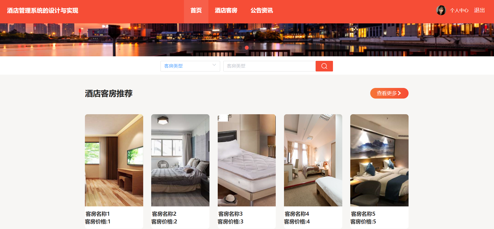
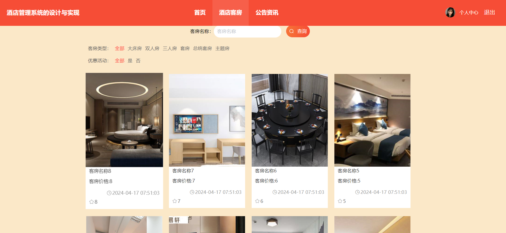
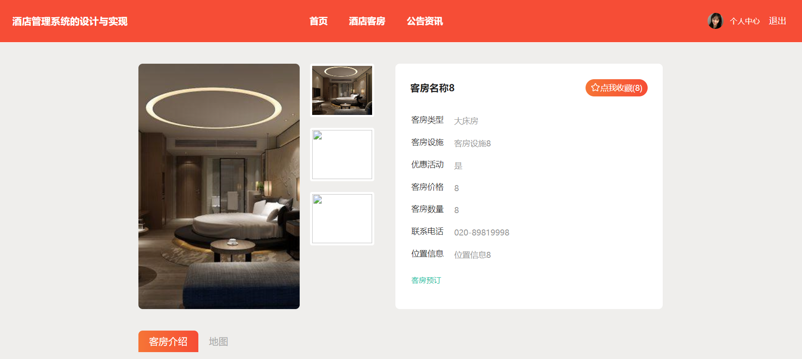
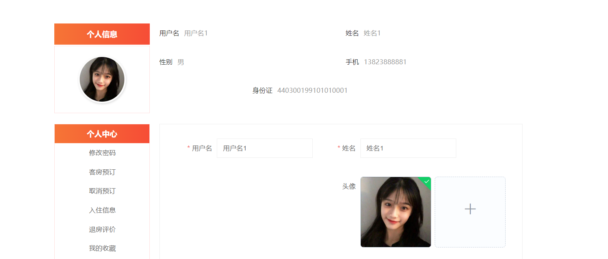
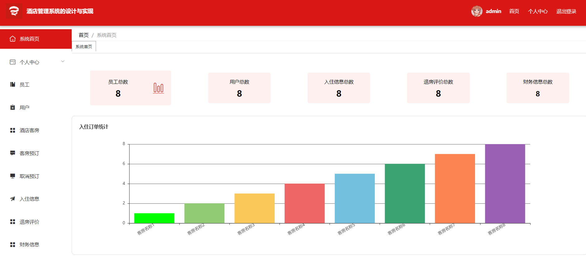
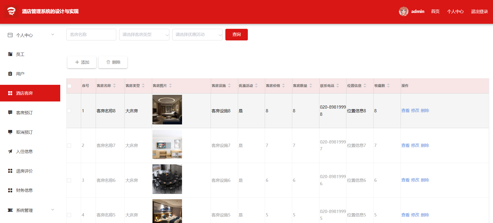
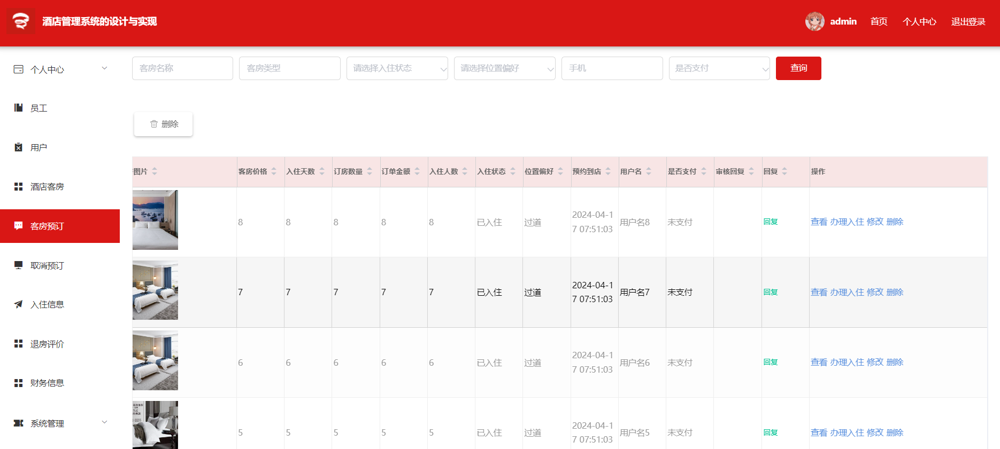
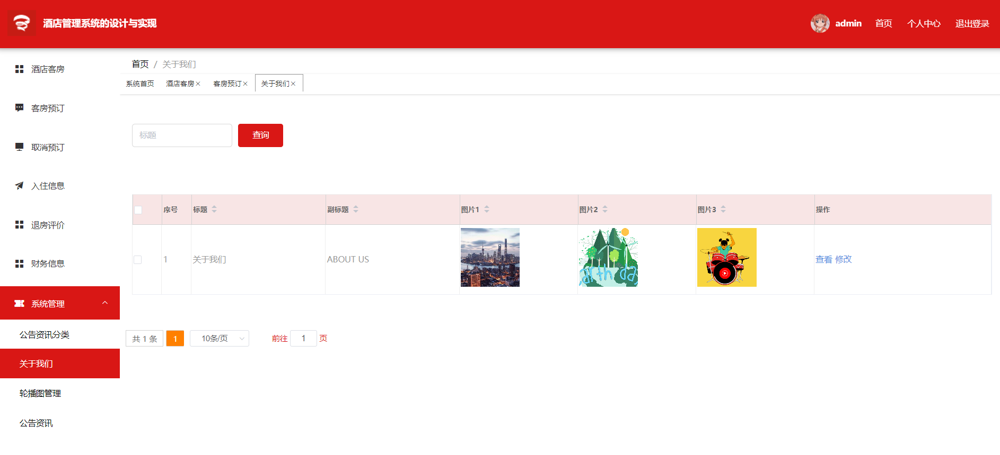

## 介绍
&emsp;&emsp;酒店管理系统，酒店预订系统，酒店客房管理系统，基于SpringBoot+Vue的酒店管理系统，具体功能如下图所示。

> 1. 后端技术：SpringBoot+MyBatis-Plus
> 2. 前端技术：Vue
> 3. 数据库：MySQL
> 4. 软件：IDEA/Ecilpse
> 5. **3119403249**

##  系统展示

&emsp;

#### 系统首页

> 导航栏、搜索栏、公告资讯、酒店客房、酒店推荐等。

#### 酒店列表

> 按类查询、搜索名称等。

#### 客房详情

> 客房的详细信息，预订。

#### 个人中心

> 个人信息编辑、修改密码、预订信息、入住信息、退房信息、收藏等。

#### 后台首页

> 左侧导航栏，上侧个人中心，主页可视化组件。

#### 酒店管理

> 管理员对酒店客房信息管理。

#### 预订管理

> 预订审核、办理入住、退房。

#### 系统管理

> 管理员管理系统信息。

